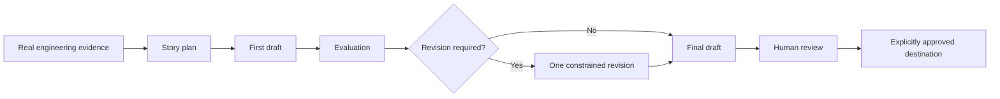

# BuildLog

[](PROJECT.md)
[](pyproject.toml)
[](tests)
[](https://ollama.com/)

**BuildLog is an AI engineering communication engine that transforms real
software development work into evidence-grounded, reviewable, and traceable
technical content.**

Evidence in. Reviewable engineering artifacts out.

## The Problem

Every software development iteration creates valuable engineering knowledge:
the problem that surfaced, the alternatives considered, the trade-offs made,
the failed attempts, and the lesson that became clear after the code worked.

Most of that knowledge disappears after the change is complete. Git preserves
what changed, but rarely captures why it mattered or how the engineer reasoned
through it. Starting from a blank writing prompt usually produces a polished
story with weak grounding.

## 🧩 Product Capabilities

BuildLog is an evidence-to-artifact AI engineering workflow. In v0.2, it
proves this workflow with one output type and destination: a human-reviewed
LinkedIn technical post that can be published only after explicit approval.

Its current business capabilities are:

- **Engineering story extraction:** turns one real development iteration into
  a clear account of the problem, decisions, trade-offs, result, and lesson.
- **Engineering content generation:** converts that story into a professional,
  evidence-grounded LinkedIn technical post draft.
- **Automated content review:** evaluates the draft for accuracy, specificity,
  readability, reader value, evidence coverage, and unsupported claims.
- **Controlled revision:** performs at most one constrained revision when the
  deterministic threshold rule requires it.
- **Transparent generation:** stores the input, plan, draft, evaluation,
  optional revision, and final Markdown for inspection.
- **Production observability:** records step timing, LLM calls, token usage
  when available, errors, revision evidence, artifact lineage, prompt hashes,
  model configuration, and replay conditions.
- **Replayable engineering workflow:** preserves enough metadata to rerun the
  same engineering iteration under the same prompts, model configuration, and
  code state as far as practical.
- **Human-controlled LinkedIn publishing:** authenticates one local LinkedIn
  member, previews the exact final artifact, blocks duplicate posts, requires
  explicit approval, and stores a safe publication receipt.
- **Reviewable publishing packages:** turns one reviewed run into a local
  LinkedIn-ready caption, grounded card plan, deterministic PNG cards, alt
  text, and a versioned manifest without publishing them.

The current product is not a general content generator. It follows this path:

```text
Engineering evidence
    ↓
Engineering narrative
    ↓
Engineering communication
```

## 🛡️ Why Trust It

BuildLog is designed around four controls.

**Evidence**

The workflow begins with concrete engineering facts: problems, actions,
decisions, trade-offs, results, lessons, and supporting evidence. The model is
not asked to invent a project story from an empty prompt.

**Evaluation**

Each draft is assessed for technical accuracy, specificity, readability,
reader value, evidence coverage, and unsupported claims. A deterministic rule
decides whether one revision is required.

**Observability**

Each run records its steps, model calls, latency, provider token usage,
revision decision, errors, artifact lineage, prompt hashes, model
configuration, and replay conditions. Missing telemetry is reported as
missing, never estimated.

**Human review**

BuildLog never makes the publishing decision. The user remains responsible for
factual accuracy, confidentiality, tone, and final approval. LinkedIn
publication requires a preview, the `--confirm` flag, and the exact interactive
confirmation `PUBLISH`.

## ⚙️ How It Works



Deterministic code handles validation, normalization, thresholds, persistence,
and trace creation. LLMs are used only for planning, writing, evaluation, and
the optional revision.

Each run preserves the input, normalized evidence, story plan, first draft,
evaluation, optional revision, final Markdown, execution timeline, ordered
events, and replay metadata.

## Different by Design

| | Generic LLM writing | BuildLog |
|---|---|---|
| Starting point | A writing request | Structured evidence from real work |
| Workflow | One open-ended generation | Plan, draft, evaluate, bounded revision |
| Quality control | Prompt instructions | Structured evaluation plus fixed rules |
| Traceability | Final text | Inspectable intermediate artifacts and lineage |
| Operational insight | Usually opaque | Step, model-call, error, and replay metadata |
| Final authority | Often presented as ready | Explicit human review |

## BuildLog v0.2

Currently included:

- Structured development-iteration input and validation
- Evidence normalization and story planning
- LinkedIn draft generation
- Five-dimension evaluation and unsupported-claim feedback
- At most one constrained revision
- Readable JSON and Markdown run artifacts
- Run, step, LLM-call, error, and artifact-lineage observability
- Replay metadata for code, prompts, model, input, and generation settings
- Local SQLite metadata and observation projections
- Versioned prompt sets for reproducible comparison
- OAuth 2.0 login for one local LinkedIn member
- Exact final-artifact preview and explicit publication approval
- Text-only personal LinkedIn publishing through a replaceable adapter
- Duplicate protection, safe receipts, and append-only publication events
- Local LinkedIn-targeted publishing packages built from reviewed runs
- Validated, grounded card specifications and deterministic 1080x1350 PNGs
- A package manifest with source, prompt, model, caption, and asset hashes

Not included:

- Automatic, scheduled, or background publishing
- Automatic LinkedIn media upload, company-page publishing, analytics, or
  deletion
- Image-generation APIs, dynamic template systems, or multi-platform packages
- Automatic GitHub, commit, issue, or diff collection
- Web UI, API, accounts, or cloud deployment
- RAG, vector search, or long-term memory
- Resume, ADR, weekly-report, or PR-description generation
- A guarantee that generated text is publishable without human editing

## 🤖 Skills Demonstrated

BuildLog is also designed as an AI Engineer portfolio project. Each baseline
must improve the product while proving a concrete engineering capability.

| AI Engineering capability | Current status in BuildLog |
|---|---|
| Prompt engineering | Demonstrated through versioned planner, writer, evaluator, and reviser prompts |
| Structured outputs | Demonstrated through validated Pydantic schemas for model outputs |
| Local LLM integration | Demonstrated through Ollama and local Qwen3 runs |
| Agentic workflow design | Demonstrated through a bounded Planner, Writer, Evaluator, and Reviser pipeline |
| AI evaluation | Demonstrated through automated scoring, human-style review, and cross-case baselines |
| Observability | Demonstrated through run metadata, timeline, events, LLM-call records, and artifact lineage |
| Reproducibility | Demonstrated through prompt hashes, artifact hashes, model config, Git state, and replay metadata |
| Backend engineering | Demonstrated through Python, Pydantic, SQLAlchemy, SQLite, repository boundaries, CLI, and tests |
| Product thinking | Demonstrated through explicit v0.1 scope, non-goals, evaluation baselines, and public showcase assets |
| Tool calling | Planned |
| Evidence collection | Planned |
| Embeddings and vector search | Planned |
| Retrieval and memory | Planned |
| Multimodal communication | Planned |
| Human-controlled LinkedIn publishing | Demonstrated through OAuth, preview, approval, duplicate protection, receipts, and mocked API tests |
| Workflow automation | Planned |

## See a Real Example

The public architecture example follows a real BuildLog iteration from input
to two generated outputs:

1. [Original engineering evidence](examples/buildlog_architecture_iteration.json)
2. [Generated post using v1 prompts](examples/outputs/architecture/linkedin_v1.md)
3. [Generated post using v2 prompts](examples/outputs/architecture/linkedin_v2.md)
4. [Human and automated quality comparison](docs/output_quality_baseline.md)

The baseline found meaningful improvement in v2 while also showing why human
review remains necessary. A separate
[five-case generalization baseline](docs/generalization_baseline.md) records
performance across architecture, debugging, infrastructure, local AI, and
developer-workflow stories.

## 🚀 Run It Locally

Requirements:

- Python 3.11 or newer
- [Ollama](https://ollama.com/) running locally
- A locally installed model such as `qwen3:8b`

```bash
git clone https://github.com/langju123456/BuildLog.git
cd BuildLog
python3 -m venv .venv
.venv/bin/pip install -e '.[dev]'
cp .env.example .env
ollama pull qwen3:8b
```

Run one included iteration:

```bash
BUILDLOG_MODEL=ollama_chat/qwen3:8b \
BUILDLOG_PROMPT_VERSION=v2 \
  .venv/bin/python -m buildlog.main examples/local_agent_iteration.json
```

The command prints the final draft path and evaluation scores. Complete local
artifacts are written under `runs/`; structured metadata is stored in
`buildlog.db`. Both remain outside Git by default.

Use `BUILDLOG_MODEL_DIGEST` when an immutable local model digest is available.
Without it, generation still works, but BuildLog honestly marks the replay
manifest as partial.

## Build a Publishing Package

After reviewing a completed run, build a local LinkedIn-ready package:

```bash
.venv/bin/buildlog package build <run-id> --confirm-reviewed
```

BuildLog writes `caption.md`, `manifest.json`, and three or four ordered PNG
cards under `.buildlog/publishing_packages/<package-id>/`. The manifest records
the package lineage, planner provenance, card specifications, alt text, and
content hashes. Package generation does not call LinkedIn or any other
publishing API; review and upload remain manual in this baseline.

## Publish to LinkedIn

Publishing is a separate downstream action. It never reruns generation and
never publishes from `preview`.

Prerequisites:

- enable **Share on LinkedIn** and **Sign In with LinkedIn using OpenID
  Connect** for the Developer App
- register the exact callback
  `http://localhost:8765/auth/linkedin/callback`
- place the Client ID and Client Secret only in the ignored local `.env`

```bash
chmod 600 .env
.venv/bin/buildlog linkedin status
.venv/bin/buildlog linkedin login
.venv/bin/buildlog linkedin whoami
.venv/bin/buildlog linkedin preview <run-id>
.venv/bin/buildlog linkedin publish <run-id> --confirm
```

The final command shows the exact content again and requires typing `PUBLISH`.
Identical successful content is blocked unless `--allow-duplicate` is supplied
deliberately. A matching unresolved attempt is also blocked until LinkedIn and
its receipt have been inspected. Tokens are stored under
`~/.buildlog/credentials/`, never in `runs/`, SQLite, Git, or terminal output.

Current publishing scope is one public, text-only personal-member post. Review
the [setup guide](docs/linkedin/setup.md), [security
model](docs/linkedin/security.md), and [manual smoke
test](docs/linkedin/manual-smoke-test.md) before publishing.

> Live validation status: real OAuth and one controlled public text smoke test
> completed successfully on 2026-07-29 with HTTP 201 and a persisted receipt.
> LinkedIn accepted the OIDC-sub-derived Person URN for this app, while the
> cross-document mapping remains explicitly labeled as inferred.

## Learn More

- [PROJECT.md](PROJECT.md): product definition, architecture, contracts, and
  long-term engineering constraints
- [TASK.md](TASK.md): the current completed sprint and scope boundaries
- [Output Quality Baseline](docs/output_quality_baseline.md): prompt-quality
  evaluation protocol and comparison
- [Generalization Baseline](docs/generalization_baseline.md): cross-case
  product evaluation
- [Example Showcase](examples/outputs/architecture/README.md): selected public
  outputs
- [Evaluation Corpus](eval_corpus/README.md): boundary for future reviewed and
  sanitized evaluation assets
- [LinkedIn Publishing Research](docs/research/linkedin-publishing.md):
  endpoint, scope, identity, and smoke-test evidence
- [LinkedIn Publishing ADR](docs/adr/ADR-linkedin-publishing-baseline.md):
  architecture and safety decisions

BuildLog is not a LinkedIn generator with extra logging. It is a small,
inspectable AI engineering workflow for turning real development evidence into
communication that can be evaluated, traced, and reviewed.
