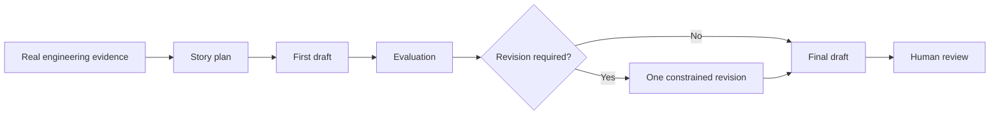

# BuildLog

**BuildLog transforms real software development work into evidence-grounded
engineering communication.**

Evidence in. Reviewable engineering artifacts out.

## The Problem

Every software development iteration creates valuable engineering knowledge:
the problem that surfaced, the alternatives considered, the trade-offs made,
the failed attempts, and the lesson that became clear after the code worked.

Most of that knowledge disappears after the change is complete. Git preserves
what changed, but rarely captures why it mattered or how the engineer reasoned
through it. Starting from a blank writing prompt usually produces a polished
story with weak grounding.

## What BuildLog Does

BuildLog is an evidence-to-artifact AI engineering workflow.

It takes one structured record of real development work, identifies the
strongest engineering story, creates a draft, evaluates it against the supplied
evidence, and performs at most one constrained revision. Every important
intermediate result remains available for inspection.

BuildLog v0.1 deliberately has one narrow output: a human-reviewed LinkedIn
post draft. The broader product idea is engineering communication; the current
implementation proves that workflow with one output type.

## Why Trust It

BuildLog is designed around four controls.

**Evidence**

The workflow begins with concrete engineering facts: problems, actions,
decisions, trade-offs, results, lessons, and supporting evidence. The model is
not asked to invent a project story from an empty prompt.

**Evaluation**

Each draft is assessed for technical accuracy, specificity, readability,
reader value, evidence coverage, and unsupported claims. A deterministic rule
decides whether one revision is required.

**Observability**

Each run records its steps, model calls, latency, provider token usage,
revision decision, errors, artifact lineage, prompt hashes, model
configuration, and replay conditions. Missing telemetry is reported as
missing, never estimated.

**Human review**

BuildLog produces a draft, not a publishing decision. The user remains
responsible for factual accuracy, confidentiality, tone, and final approval.
There is no automatic LinkedIn publishing.

## How It Works



Deterministic code handles validation, normalization, thresholds, persistence,
and trace creation. LLMs are used only for planning, writing, evaluation, and
the optional revision.

Each run preserves the input, normalized evidence, story plan, first draft,
evaluation, optional revision, final Markdown, execution timeline, ordered
events, and replay metadata.

## Different by Design

| | Generic LLM writing | BuildLog |
|---|---|---|
| Starting point | A writing request | Structured evidence from real work |
| Workflow | One open-ended generation | Plan, draft, evaluate, bounded revision |
| Quality control | Prompt instructions | Structured evaluation plus fixed rules |
| Traceability | Final text | Inspectable intermediate artifacts and lineage |
| Operational insight | Usually opaque | Step, model-call, error, and replay metadata |
| Final authority | Often presented as ready | Explicit human review |

## BuildLog v0.1

Currently included:

- Structured development-iteration input and validation
- Evidence normalization and story planning
- LinkedIn draft generation
- Five-dimension evaluation and unsupported-claim feedback
- At most one constrained revision
- Readable JSON and Markdown run artifacts
- Run, step, LLM-call, error, and artifact-lineage observability
- Replay metadata for code, prompts, model, input, and generation settings
- Local SQLite metadata and observation projections
- Versioned prompt sets for reproducible comparison

Not included:

- Automatic LinkedIn publishing
- Automatic GitHub, commit, issue, or diff collection
- Web UI, API, accounts, or cloud deployment
- RAG, vector search, or long-term memory
- Resume, ADR, weekly-report, or PR-description generation
- A guarantee that generated text is publishable without human editing

## See a Real Example

The public architecture example follows a real BuildLog iteration from input
to two generated outputs:

1. [Original engineering evidence](examples/buildlog_architecture_iteration.json)
2. [Generated post using v1 prompts](examples/outputs/architecture/linkedin_v1.md)
3. [Generated post using v2 prompts](examples/outputs/architecture/linkedin_v2.md)
4. [Human and automated quality comparison](docs/output_quality_baseline.md)

The baseline found meaningful improvement in v2 while also showing why human
review remains necessary. A separate
[five-case generalization baseline](docs/generalization_baseline.md) records
performance across architecture, debugging, infrastructure, local AI, and
developer-workflow stories.

## Run It Locally

Requirements:

- Python 3.11 or newer
- [Ollama](https://ollama.com/) running locally
- A locally installed model such as `qwen3:8b`

```bash
git clone https://github.com/langju123456/BuildLog.git
cd BuildLog
python3 -m venv .venv
.venv/bin/pip install -e '.[dev]'
cp .env.example .env
ollama pull qwen3:8b
```

Run one included iteration:

```bash
BUILDLOG_MODEL=ollama_chat/qwen3:8b \
BUILDLOG_PROMPT_VERSION=v2 \
  .venv/bin/python -m buildlog.main examples/local_agent_iteration.json
```

The command prints the final draft path and evaluation scores. Complete local
artifacts are written under `runs/`; structured metadata is stored in
`buildlog.db`. Both remain outside Git by default.

Use `BUILDLOG_MODEL_DIGEST` when an immutable local model digest is available.
Without it, generation still works, but BuildLog honestly marks the replay
manifest as partial.

## Learn More

- [PROJECT.md](PROJECT.md): product definition, architecture, contracts, and
  long-term engineering constraints
- [TASK.md](TASK.md): the current completed sprint and scope boundaries
- [Output Quality Baseline](docs/output_quality_baseline.md): prompt-quality
  evaluation protocol and comparison
- [Generalization Baseline](docs/generalization_baseline.md): cross-case
  product evaluation
- [Example Showcase](examples/outputs/architecture/README.md): selected public
  outputs
- [Evaluation Corpus](eval_corpus/README.md): boundary for future reviewed and
  sanitized evaluation assets

BuildLog is not a LinkedIn generator with extra logging. It is a small,
inspectable AI engineering workflow for turning real development evidence into
communication that can be evaluated, traced, and reviewed.
